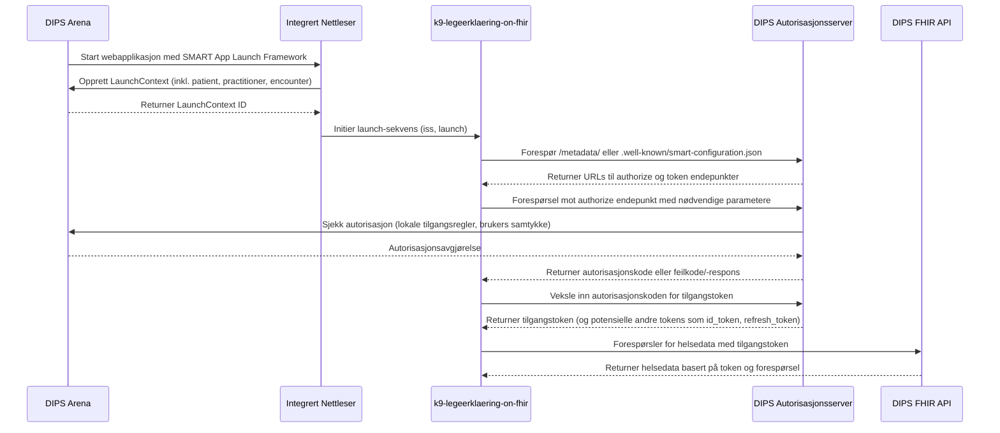

# K9 Leegerklæring on FHIR

## Getting Started

### Requirements
- [Node.js](https://nodejs.org/en/) >= 18.x.x
- [npm](https://www.npmjs.com/) >= 9.x.x
- @Navikt packages authenticated with Github Packages [Click here for guide](https://github.com/navikt/frontend#installere-pakker-lokalt)

### Environment variables
Create a .env file in the root of the project with the following variables: 
- `FHIR_API_URL`
- `FHIR_SUBSCRIPTION_KEY`

The value of `FHIR_SUBSCRIPTION_KEY` can be retrieved [OPEN DIPS Profile](https://open.dips.no/profile)

### Install dependencies
```bash
npm ci
 ```
### Run the development server
```bash
npm run dev
```
Open [http://localhost:3000](http://localhost:3000) with your browser to see the result.

### Build the server with docker
```bash
docker build -t k9-legeerklaering-on-fihr .
```

### Run the docker image
```bash
docker run -p 8080:8080 k9-legeerklaering-on-fihr:latest
```

## Løsningsbeskrivelse
Visualisert løsningsbeskrivelse som beskrevet i [Implementasjonsguide SMART App Launch Framework](https://helsenorge.atlassian.net/wiki/spaces/HELSENORGE/pages/67469415/Implementasjonsguide+SMART+App+Launch+Framework)

[Mermaid Live Editor](https://mermaid.live/edit#pako:eNqFVF1v2jAU_StXfuqkhG8G5KESW1uNqesq2PYwIU0uuQTjxM5sp_RD_Tn7D33vH9t1CBRKt_IS7Jx7fO45N75nMx0ji5jF3wWqGZ4InhieTRXQL-fGiZnIuXJwevkZuIWT0eUEhgYVP4R8MHpl0XjYSDlMDBoHF-hcirR9iB_mucfKQZhigmhkytEIlYRahfOFeK2icIsJmuv1IWsthdNGWG6XWllbvjusO_s0Gm8rysXwcjRVayB1Fh4fV-IjmDgqhBVe8TxPhSyJIcMYJl-G42-l6HNeqNkCzsgoXGkj1zwVA3ERYwRf89xQ7xX4oyZHbhwcCSXTGolzApULIDd85oQTWqEJgBLQBQHNu2dpu9rG6ApDyBeko5OXCkhlRCEQMYHTEhxalNeoLEmwNqg2q3MI7ou27kZwpg3a_OnRQD1Dx2PueB0wTYmutqJnKJVeqbrNyKxwptVcJIXhvo_a0urK2WfCcKNp28H38bkFJ1LgBKIE7xB0Ak5LVGRDjHmhpNtk-R99FlPItNuh2VaXqamnx5jajkWCfiQoMWLFA31VaJMlSum5tjMFR6mWPEWvNeEqsQaT1Gd1ZQqJxoLlmbuVEvcj29W6N6L8OlmSbEwtvm3SrhAr6UutIpijSP2yHnoX6N2_bPqB0pJ2odQhl4K5Ntu2SuffVrQHhyOKLNeOpkp4YcBVbHAdIhmjMxDxr3IVgME5aV2sl3tj57_H3UDLBknZwnvkB6_M8RWdvvBQ4XPZFbf-Bsqf_lRzRWrnO3PDApahybiI6QK895xT5haY4ZRF9Dfm9GWzqXognDdvcqtmLHKmwIAVOZ2wuSxZNOd05mb3NBbk9HaTLqCfWmebSlqy6J7dsCjsNbq1bqvfbbba7zuDQaMXsFsWdTq1waDZ6Ta6rUGr3Wv2Ow8BuysZmrX2oNXvdFu9dqPZ6_fb7Ye_hGQC0A)

## Learn More

To learn more about Next.js, take a look at the following resources:

- [Next.js Documentation](https://nextjs.org/docs) - learn about Next.js features and API.
- [Learn Next.js](https://nextjs.org/learn) - an interactive Next.js tutorial.
