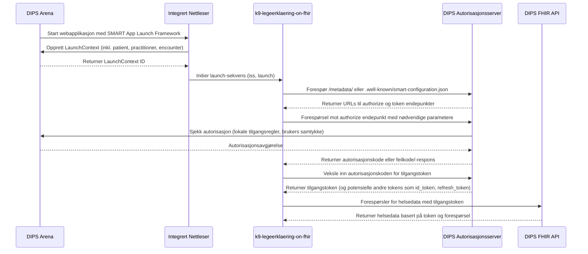

# K9 Leegerklæring on FHIR

## Getting Started

### install dependencies
```bash
npm ci
 ```
### Run the development server
```bash
npm run dev
```

Open [http://localhost:3000](http://localhost:3000) with your browser to see the result.


## Løsningsbeskrivelse
Visualisert løsningsbeskrivelse som beskrevet i [Implementasjonsguide SMART App Launch Framework](https://helsenorge.atlassian.net/wiki/spaces/HELSENORGE/pages/67469415/Implementasjonsguide+SMART+App+Launch+Framework)

[Mermaid Live Editor](https://mermaid.live/edit#pako:eNqFVMtu2zAQ_BWCpxSQ7DiWHVuHAG6TAC7SJojbHgoDBSOtZJoUqZJUnAfyOf2H3PNjXcryK04bX2RSs8PZmRUfaaJToDG18LsClcApZ7lhxVQR_JXMOJ7wkilHzq4-E2bJ6fhqQkYGFNuHfDR6YcF42Fg5yA0YR76CcxJwex8_KkuPFcNQQg5ghGRguMpDrcJsxt-qqNxsAuZ2echSy9V4qpZIlBienDQqYjJxWEkWcMPKUnLB7FwrUkBKJl9G19_q0y9YpZIZOceOYaGNWPI0DMiFjDG5LEuDTTTgTxpbu3PkgCshW6jOcVAuIKVhieOOawUmIGilrhBoPmykbWu7BlcZRL4iHZ--VoAqY3QTiREsa3BoQdyCsijB2qDZbM5BuC9a2xSTc23Ali_PhrQLcCxljrUJSIl0rQU-Q6H0QrVtgWaFiVYZzyvDfB-tudWNsxvCcKVp3cH36wtLHJeEIUgb_gBE58RpAQptSKGslHCr-P-jz4IkhXZbNOvqOjX18pxi2ynPwc8EJoassKevCW0yByE8F1LZZfQHUgsmwWvNmcqtgVz6rG5MJcBYYlnh7oWA3ci2tY626Cy7zecoG6SF903aFmIFfnJNBBlw6Zft0LuA7_5l0w8QFrVzpfa5FMm0WbdVO_--oh04OcDISu1wqrgXRphKDSxDRGN0QXj6q14FxECGWmfL5c7Y1cZv8qz7Q2Ezb5GfuzrGN2SunN7Rt6m6YdZfJOXLn2aqUGu2NTVTRQNagCkYT_Eme_SkU-pmUMCUxvg3Zfhl06l6Qpw3b3KvEho7U0FAqxLPWN16NM4YnrraPUs5Or3exBvop9bFqhKXNH6kdzQ-6rai407vcNAfdA6jbnQcBfSexsNOazjsdPuDXj8aDLu9_lNAH2qCTqs7PBpEvaNhhCX9Xid6-guMle_s)

## Learn More

To learn more about Next.js, take a look at the following resources:

- [Next.js Documentation](https://nextjs.org/docs) - learn about Next.js features and API.
- [Learn Next.js](https://nextjs.org/learn) - an interactive Next.js tutorial.
