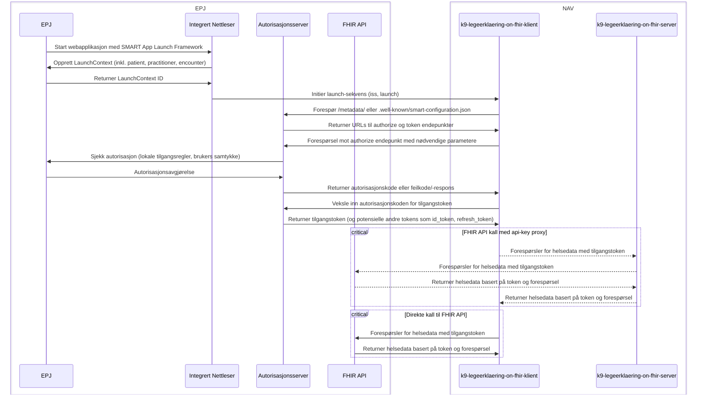

# K9 Legeerklæring on FHIR

## Start

### Forutsetninger

- [Node.js](https://nodejs.org/en/) >= 18.x.x
- [npm](https://www.npmjs.com/) >= 9.x.x
- @Navikt packages authenticated with GitHub
  Packages [Click here for guide](https://github.com/navikt/frontend#installere-pakker-lokalt)

### Miljøvariabler

Lag en `.env` fil i roten av prosjektet med følgende variabler:

- `FHIR_BASE_URL=https://api.dips.no/fhir`
- `FHIR_SUBSCRIPTION_KEY` (can be retrieved [OPEN DIPS Profile](https://open.dips.no/profile))
- `HELSEOPPLYSNINGER_SERVER_BASE_URL=https://helseserver.intern.dev.nav.no`
- `HELSEOPPLYSNINGER_SERVER_SCOPE=api://dev-gcp.helseopplysninger.server-helse/.default`
- `AZURE_APP_CLIENT_ID=k9-legeerklaering-on-fhir`
- `AZURE_APP_CLIENT_SECRET=some-secret`
- `AZURE_APP_WELL_KNOWN_URL=http://localhost:8080/default/.well-known/openid-configuration` (well-known URL for
  mocked Azure AD-containeren i docker-compose)

Hvis du vil utføre frontend-utvikling med en falsk helseopplysninger-backend i stedet for å måtte koble til en ekte
tjeneste må du sette `FAKE_HELSEOPPLYSNINGER=fake1` i `.env`-filen. Dette unngår behovet for å kjøre docker-compose med
mocked Azure AD-container.

### Installer avhengigheter

```bash
npm ci
 ```

### Kjør utviklingsserveren

```bash
npm run dev
```

Tjenesten vises på [http://localhost:3000](http://localhost:3000).

### Bygg med Docker

```bash
docker build -t k9-legeerklaering-on-fihr .
```

### Kjør docker image

```bash
docker run -p 8080:8080 k9-legeerklaering-on-fihr:latest
```

### Kjør med docker-compose

Kjør applikasjonen med docker-compose for å få med mock azure ad.

```bash
docker compose -f docker-compose.yaml up --build
```

## Løsningsbeskrivelse

Visualisert løsningsbeskrivelse som beskrevet
i [Implementasjonsguide SMART App Launch Framework](https://helsenorge.atlassian.net/wiki/spaces/HELSENORGE/pages/67469415/Implementasjonsguide+SMART+App+Launch+Framework)



#### Forklaring av diagram

| Linje | Forklaring                                                                                                                                                                                                   |
|-------|--------------------------------------------------------------------------------------------------------------------------------------------------------------------------------------------------------------|
| ----- | Alle kall til FHIR API får en [api-nøkkel](src/app/api/fhir/proxy/[...api-path]/route.ts) som hentes og legges på via [k9-legeerklæring-on-fhir-_server_](src/integrations/fhir/ProxiedFhirClientWrapper.ts) |
| ___   | Alle kall går [direkte fra k9-legeerklæring-on-fhir-_client_ til FHIR API](src/integrations/fhir/FhirClientWrapper.ts)                                                                                       |
