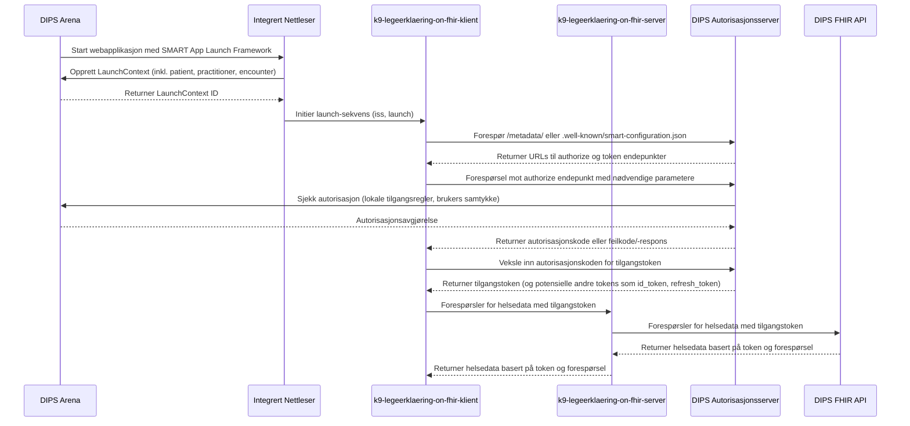

# K9 Legeerklæring on FHIR

## Getting Started

### Requirements

- [Node.js](https://nodejs.org/en/) >= 18.x.x
- [npm](https://www.npmjs.com/) >= 9.x.x
- @Navikt packages authenticated with Github
  Packages [Click here for guide](https://github.com/navikt/frontend#installere-pakker-lokalt)

### Environment variables

Create a .env file in the root of the project with the following variables:

- `FHIR_BASE_URL=https://api.dips.no/fhir`
- `FHIR_CLIENT_ID=NAV_legeerklaering`
- `FHIR_SUBSCRIPTION_KEY` (can be retrieved [OPEN DIPS Profile](https://open.dips.no/profile))
- `HELSEOPPLYSNINGER_SERVER_BASE_URL=https://helseserver.intern.dev.nav.no`
- `HELSEOPPLYSNINGER_SERVER_SCOPE=api://dev-gcp.helseopplysninger.server-helse/.default`
- `AZURE_APP_CLIENT_ID=k9-legeerklaering-on-fhir`
- `AZURE_APP_CLIENT_SECRET=some-secret`
- `AZURE_APP_WELL_KNOWN_URL=http://localhost:8080/default/.well-known/openid-configuration` (the well-known url for the mocked azure ad container i docker-compose)
### Install dependencies

```bash
npm ci
 ```

### Run the development server

```bash
npm run dev
```

Open [http://localhost:3000](http://localhost:3000) with your browser to see the result.

### Build the server with docker

```bash
docker build -t k9-legeerklaering-on-fihr .
```

### Run the docker image

```bash
docker run -p 8080:8080 k9-legeerklaering-on-fihr:latest
```

### Run with docker-compose

To run with mocked azure ad, run the application with docker-compose.

```bash
docker compose -f docker-compose.yaml up --build
```

## Løsningsbeskrivelse

Visualisert løsningsbeskrivelse som beskrevet
i [Implementasjonsguide SMART App Launch Framework](https://helsenorge.atlassian.net/wiki/spaces/HELSENORGE/pages/67469415/Implementasjonsguide+SMART+App+Launch+Framework)



[Mermaid Live Editor](https://mermaid.live/edit#pako:eNqdVclu2zAU_BWCpxSQvNTxpkMAp0lQF2kb2G0PhYGCkZ5lmhSpklScBfmc_kPu-bE-yvIWZynqi0163nDezBN1R2OdAI2ohd8FqBhOOEsNyyaK4CdnxvGY50w5cnrxiTBLToYXYzIwoNg-5NjohQXjYUPlIDVgHPkCzknA7X38IM89VvRDCSmAEZKB4SoNtQqnM25CITko92xheMxiASp5nQCPvXr25MLNxuV_m54Kpw23zM61si_VnX0cjtYV5WJwMZyoJRAdCo-OKhMiMnZYSBZwyfJcclESkwwSMv48GH0rmz9nhYpn5AwNh4U2YslTMSAXMkbka54b9LACf9Do7LUjB1wJWUNxzlsUkNyw2HHHtQITEExSFwg07zbStrWNwBUGkU9IhydPFaDKCMNEYgTLEoymiitQFiVYG1Sb1Tk-GCxauxuRM23A5o8PhtQzcCxhjtUJSIl0tQV-h0LpharbDM0KY62mPC0M833U5lZXzm4Iw5WmdQffR-eWOC4JQxAmeAtEp8RpHA60IYG8UMKtsnxFnwVJMu22aNbVZWrq8SHBthOegh8JTAxZYU9fFdp4DkJ4rvVMkQOpBZPgtaZMpdZAKn1Wl6YQYCyxLHM3QsBuZNtad0aUXaVzlA3SwtsmbQuxAp_4KoIpcOmX9dC7gP-9ZNMPEBa1c6X2uRSZarNuq3T-bUU7cHKAkeXa4VRxL4wwlRhYhojG6Izw5Fe5CoiBKWqdLZe7Y7e5FbZzLftEgTNvlZ-_Ms7n5G7qkc0_3f9F4wvDp3LWfW_KL5n192P--KeaVvRgujWN-6L2TPx3MhrQDEzGeIJ3_Z2nnlA3gwwmNMKfCUxZId2ETtQ9Qn3E4xsV08iZAgJa5HjI6tVAoynDY1e7pwnHeVhv4jX5U-tsVYlLGt3RaxqFzU6v1u51Ou1uo9dt9ZvNgN7Q6H2zVWsfNg77nUav12w27wN6W9Y3ar1Oq99tHLZ77Ua33er2AgrlWZ-Xb6zyxXX_F28xX-U)

## Learn More

To learn more about Next.js, take a look at the following resources:

- [Next.js Documentation](https://nextjs.org/docs) - learn about Next.js features and API.
- [Learn Next.js](https://nextjs.org/learn) - an interactive Next.js tutorial.
